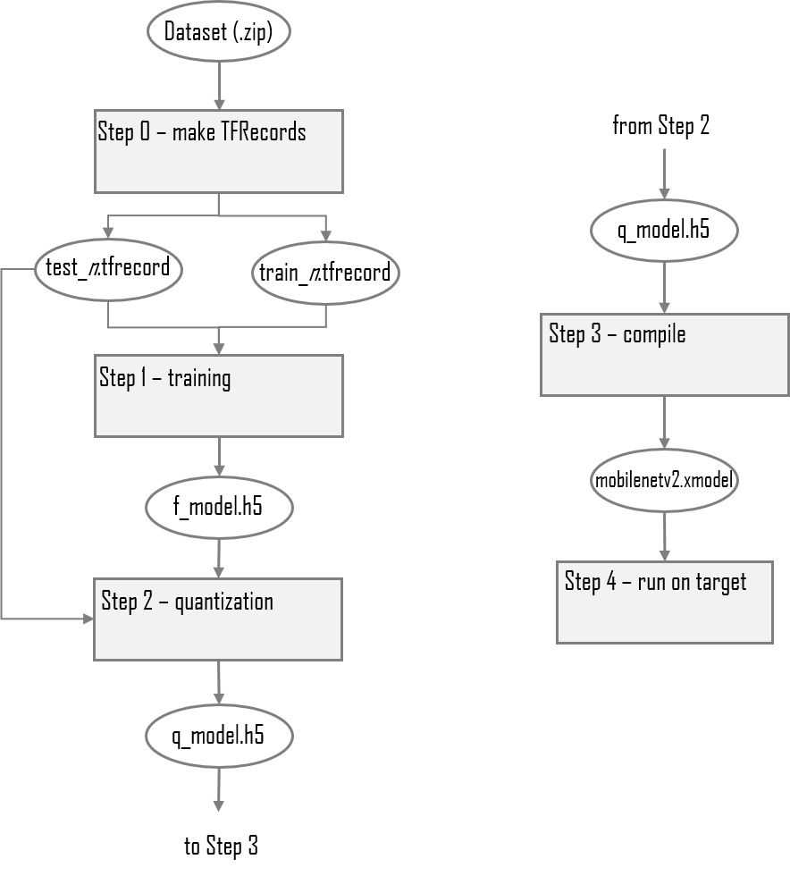

<!--
Author: Mark Harvey, Xilinx Inc
-->
<table class="sphinxhide">
  <tr>
 <td align="center"><h1>TensorFlow2 implementation of MobileNetV2</h1>
 </td>
 </tr>
</table>

A TensorFlow2 version of MobileNetv2 with complete source code. The MobileNetv2 model is trained from scratch using the Kaggle dogs-vs-cats dataset.

### Current status

+ Tested on VCK190 ES1
+ Tools used: TensorFlow2.3 & Vitis AI 1.4
+ Dataset: [Kaggle dogs-vs-cats](https://www.kaggle.com/c/dogs-vs-cats/data)
+ Network: MobileNetv2

## Introduction

We will run the following steps:

  + Download and preparation of the Kaggle dogs-vs-cats dataset. Conversion of images to TFRecords.
  + Training and evaluation of a custom CNN using TensorFlow's built-in version of Keras.
  + Quantization of the floating-point model using the Xilinx® quantizer provided as part of Vitis AI.
  + Evaluation of the quantized model using the dogs-vs-cats test dataset.
  + Compilation of the quantized model for execution on the target boards.
  + Execution of the network on the target boards with the provided Python scripts.

The complete flow is shown in the figure below:

<p align="center">
 
</p>

## The Kaggle Dogs-vs-Cats Dataset

The [Kaggle dog-vs-cats dataset](https://www.kaggle.com/c/dogs-vs-cats/data) consists of 25000 images of varying dimensions, divided into the two classes of *cat* and *dog*. Each image is intrinsically labelled or classified by its filename, for example the image with filename *cat.12.jpg* is obviously of class *cat*.

There is also a set of labelled images which were part of the original Kaggle dogs-vs-cats challenge, but we will ignore this set and only use the 25000 images that are contained in the train.zip archive.

The 25000 images are all resized to 224 x 224 pixels and then divided into either the train or test datasets.

## MobileNetV2 architecture

MobileNetV2 was defined by Google as an extension and improvement on their earlier MobileNet architecture (now often referred to as MobileNetV1). It introduced the concepts of 'inverted residual' and 'linear bottleneck' blocks.

The complete architecture is composed of blocks like this:

<p align="center">
  
</p>

## Before You Begin

The host machine has several requirements that need to be met before we begin. You will need:

  + An x86 host machine with a supported OS and either the CPU or GPU versions of the Vitis-AI docker installed - see [System Requirements](https://github.com/Xilinx/Vitis-AI/blob/master/docs/learn/system_requirements.md).

  + The host machine will require Docker to be installed and the Vitis-AI CPU or GPU docker image to be built - see [Getting Started](https://github.com/Xilinx/Vitis-AI#getting-started).

  + A GPU card suitable for ML training - a GPU with at least 8GB of memory is recommended.

For more details, refer to the latest version of the *Vitis AI User Guide* ([UG1414](https://www.xilinx.com/html_docs/vitis_ai/1_4/zmw1606771874842.html)).

This tutorial assumes the user is familiar with Python3, TensorFlow and has some knowledge of machine learning principles.

## Setting up the workspace and dataset

1. Copy the repository by doing either of the following:

    + Download the repository as a ZIP file to the host machine, and then unzip the archive.
    + From a terminal, use the `git clone` command.

2. Download the Kaggle dogs-vs-cats dataset.

    + Go to the [Kaggle website](https://www.kaggle.com/c/dogs-vs-cats/data) and register a new account if necessary.
    + Download the [dataset](https://www.kaggle.com/c/dogs-vs-cats/data).
    + Move dogs-vs-cats.zip into the `files` folder in the design repository, which is the same folder that contains the python (`.py`) and shell (`.sh`) scripts.

    The Kaggle dog-vs-cats dataset consists of 25,000 images of varying dimensions, divided into two classes: cat and dog. Each image is intrinsically labelled or classified by its filename (for example, `cat.12.jpg`).

    There is a set of unlabelled images which were part of the original Kaggle dogs-vs-cats challenge, but we will not use it in this tutorial. Only the 25000 images that are contained in the `train.zip` archive will be used.

3. Open a linux terminal, `cd` to the repository folder, and then `cd` to the `files` folder.
   
4. Start the Vitis AI GPU docker:

     ```shell
     # navigate to tutorial folder
     cd <path_to_tutorial>/files

     # to start GPU docker container
     ./docker_run.sh xilinx/vitis-ai-gpu:latest
     ```

  The docker container will start and after accepting the license agreement, you should see something like this in the terminal:

    ```shell
    ==========================================
    
    __      ___ _   _                   _____
    \ \    / (_) | (_)            /\   |_   _|
     \ \  / / _| |_ _ ___ ______ /  \    | |
      \ \/ / | | __| / __|______/ /\ \   | |
       \  /  | | |_| \__ \     / ____ \ _| |_
        \/   |_|\__|_|___/    /_/    \_\_____|
    
    ==========================================
    Docker Image Version:  latest 
    Build Date: 2021-08-04
    VAI_ROOT: /opt/vitis_ai

    For TensorFlow 1.15 Workflows do:
         conda activate vitis-ai-tensorflow 
    For Caffe Workflows do:
         conda activate vitis-ai-caffe 
    For Neptune Workflows do:
         conda activate vitis-ai-neptune 
    For PyTorch Workflows do:
         conda activate vitis-ai-pytorch 
    For TensorFlow 2.3 Workflows do:
         conda activate vitis-ai-tensorflow2 
    For Darknet Optimizer Workflows do:
         conda activate vitis-ai-optimizer_darknet 
    For TensorFlow 1.15 Optimizer Workflows do:
         conda activate vitis-ai-optimizer_caffe 
    For TensorFlow 1.15 Workflows do:
         conda activate vitis-ai-optimizer_tensorflo
    Vitis-AI /workspace > 
    ```

>:bulb: *If you get a "Permission Denied" error when starting the docker container, it is almost certainly because the docker_run.sh script is not set to be executable. You can fix this by running the following command:*
>    
>    ```shell
>     chmod +x docker_run.sh
>    ```


Activate the Tensorflow2 python virtual environment with `conda activate vitis-ai-tensorflow2` and you should see the prompt change to indicate that the environment is active:


```shell
Vitis-AI /workspace > conda activate vitis-ai-tensorflow2
(vitis-ai-tensorflow2) Vitis-AI /workspace > 
```

*The remainder of this README describes each single step to implement the tutorial, however a shell script called run_all.sh is provided which will run the complete flow, including downloading and installing the patches:*

```shell
(vitis-ai-tensorflow2) Vitis-AI /workspace > source run_all.sh
```


## Step 0 - Converting the dataset images to TFRecords

To run step 0:

```shell
(vitis-ai-tensorflow2) Vitis-AI /workspace > python -u images_to_tfrec.py -bd ${BUILD} 2>&1 | tee ${LOG}/tfrec.log
```

To speed up training, the JPEG images of the dogs-vs-cats dataset will be converted into the TFRecord format. The `images_to_tfrec.py` script will do the following:

+ Unzip the dogs-vs-cats.zip archive into the folder.
+ Split the images into the train and test datasets, ensuring a balance between classes.
+ Convert each image and label into a TFRecord. The TFRecord files are written into .tfrecord files in the folder defined by the `--build_dir` argument.

Each TFRecord has five fields that are defined by the feature dictionary:

```python
# features dictionary
feature_dict = {
  'label' : _int64_feature(label),
  'height': _int64_feature(image_shape[0]),
  'width' : _int64_feature(image_shape[1]),
  'chans' : _int64_feature(image_shape[2]),
  'image' : _bytes_feature(image)
}
```

The label is obtained by looking at the first part of the image file name and assigning either '0' for dog or '1' for cat:

```python
class_name,_ = img.split('.',1)
if class_name == 'dog':
  label = 0
else:
  label = 1
```

Each JPEG image file is read into a TensorFlow string (tf.string) and its shape is obtained from the JPEG header - this avoids having to JPEG decode the image which means the script runs faster and also the TFRecord files are more compact:

```python
# read the JPEG source file into a tf.string
image = tf.io.read_file(filePath)

# get the shape of the image from the JPEG file header
image_shape = tf.io.extract_jpeg_shape(image, output_type=tf.dtypes.int32, name=None)
```

The number of image/label pairs in each .tfrecord file is defined by the `--img_shard` argument.

Note that this step only needs to be run once as long as the TFRecord files are not deleted.


## Step 1 - Training

To run step 1:

```shell
(vitis-ai-tensorflow2) Vitis-AI /workspace > python -u train.py -bd ${BUILD} 2>&1 | tee ${LOG}/train.log
```

During training, the TFRecord files are read into the tf.data pipeline by the `input_fn_trn` function defined in `dataset_utils.py`. This function finds all TFRecord files whose names match the pattern train_*.tfrecord and creates a tf.data.Dataset object. The function also includes all the image pre-processing (resizing and random cropping, augmentation and normalization):


```python
def input_fn_trn(tfrec_dir,batchsize,height,width):
    '''
    Dataset creation and augmentation for training
    '''
    tfrecord_files = tf.data.Dataset.list_files('{}/train_*.tfrecord'.format(tfrec_dir), shuffle=True)
    dataset = tf.data.TFRecordDataset(tfrecord_files)
    dataset = dataset.map(parser, num_parallel_calls=tf.data.experimental.AUTOTUNE)
    dataset = dataset.map(lambda x,y: resize_random_crop(x,y,h=height,w=width), num_parallel_calls=tf.data.experimental.AUTOTUNE)
    dataset = dataset.batch(batchsize, drop_remainder=False)
    dataset = dataset.map(augment, num_parallel_calls=tf.data.experimental.AUTOTUNE)
    dataset = dataset.map(normalize, num_parallel_calls=tf.data.experimental.AUTOTUNE)
    dataset = dataset.prefetch(buffer_size=tf.data.experimental.AUTOTUNE)
    dataset = dataset.repeat()
    return dataset
```


The validation phase uses the `input_fn_test` function which will make a dataset from all TFRecord files which match the glob pattern test_*.tfrecord. Note how there is no augmentation, only resizing and normalization and the dataset does not repeat:


```python
def input_fn_test(tfrec_dir,batchsize,height,width):
    '''
    Dataset creation and augmentation for test
    '''
    tfrecord_files = tf.data.Dataset.list_files('{}/test_*.tfrecord'.format(tfrec_dir), shuffle=False)
    dataset = tf.data.TFRecordDataset(tfrecord_files)
    dataset = dataset.map(parser, num_parallel_calls=tf.data.experimental.AUTOTUNE)
    dataset = dataset.map(lambda x,y: resize_central_crop(x,y,h=height,w=width), num_parallel_calls=tf.data.experimental.AUTOTUNE)
    dataset = dataset.batch(batchsize, drop_remainder=False)
    dataset = dataset.map(normalize, num_parallel_calls=tf.data.experimental.AUTOTUNE)
    dataset = dataset.prefetch(buffer_size=tf.data.experimental.AUTOTUNE)
    return dataset
```

During training, the learning rate is modified by the `lr_scheduler_call` callback which uses the `step_decay` function to reduce the learning rate by 10 after 15 epochs, by 100 after 40 epochs:

```python
def step_decay(epoch):
    '''
    Learning rate scheduler used by callback
    Reduces learning rate depending on number of epochs
    '''
    lr = learnrate
    if epoch > 40:
        lr /= 100
    elif epoch > 15:
        lr /= 10
    return lr
```


The complete list of command line arguments of `train.py` are as follows:

|Argument|Default|Description|
|:-------|:-----:|:----------|
|--build_dir|build|Build folder|
|--input_height|224|Input images are resized to input_height x input_width|
|--input_width|224|Input images are resized to input_height x input_width|
|--input_chan|3|Number of channels in input image - leave at default|
|--batchsize|50|Batchsize used in training and validation - adjust for memory capacity of your GPU(s)|
|--epochs|50|Number of training epochs|
|--learnrate|0.001|Initial learning rate for optimizer|


## Step 2 - Quantization

To run step 2:

```shell
(vitis-ai-tensorflow2) Vitis-AI /workspace > python -u quantize.py -bd ${BUILD} --evaluate 2>&1 | tee ${LOG}/quantize.log
```

The Xilinx DPU family of ML accelerators execute models and networks that have their parameters in integer format so we must convert the trained, floating-point checkpoint into a fixed-point integer checkpoint - this process is known as quantization.

The `quantize.py` script will do the following:

+ Make a folder (default name is quant_model) to contain the quantized model in HDF5 format.
+ Create a tf.data.Dataset object using the `input_fn_quant` defined in `dataset_utils.py`
     + this tf.data.Dataset is used to provide images for calibration.
+ Run the quantization process using the Vitis-AI quantizer plug-in for TensorFlow2.
+ Save the quantized HDF5 model.
+ If the `--evaluate` command line argument is included, then the `quantize.py` script will evaluate the accuracy of the quantized model using the same test dataset that was used for validation during training.

The evaluation of the quantized model should give an accuracy of approximately 96%. If a different dataset is used that has more classes, then fine-tuning may be required. 

The complete list of command line arguments of `quantize.py` are as follows:

|Argument|Default|Description|
|:-------|:-----:|:----------|
|--build_dir|build|Build folder|
|--batchsize|50|Batchsize used in training and validation - adjust for memory capacity of your GPU(s)|
|--evaluate|False|Enables evaluation of quantized model|


## Step 3 - Compiling for the target

To run step 3, run the `source compile.sh` with one of the target boards as a command line argument, for example:

```shell
(vitis-ai-tensorflow2) Vitis-AI /workspace > source compile.sh vck190 ${BUILD} ${LOG}
```

The script also supports `u280` and `zcu102` as a command line arguments to target the Alveo U280 and Zynq ZCU102 evaluation boards. The `compile.sh` shell script will compile the quantized model and create an .xmodel file which contains the instructions and data to be executed by the DPU.

## Step 4 - Running the application on the target

To prepare the images, xmodel and application code for copying to the selected target, run any or all of the following commands:

```shell
(vitis-ai-tensorflow2) Vitis-AI /workspace > python -u target.py -t zcu102 | tee ${LOG}/target_zcu102.log
(vitis-ai-tensorflow2) Vitis-AI /workspace > python -u target.py -t u280   | tee ${LOG}/target_u280.log
(vitis-ai-tensorflow2) Vitis-AI /workspace > python -u target.py -t vck190 | tee ${LOG}/target_vck190.log
```

The `target.py` script will do the following:

+ Convert the test dataset from TFRecords format to JPEG image files.
+ Resize the test images and copy them to the target folder.
     + the number of images is set by the `--num_images` command line argument which defaults to 1000.
+ Copy the compiled model to the target folder.
+ Copy the Python application code to the target folder.


### VCK190

The entire `target_vck190` folder will be copied to the VCK!90's SDcard. Copy it to the /home/root folder of the flashed SD card, this can be done in one of several ways:

1. Direct copy to SD Card:

  + If the host machine has an SD card slot, insert the flashed SD card and when it is recognised you will see two volumes, BOOT and ROOTFS. Navigate into the ROOTFS and then into the /home folder.  Make the ./root folder writeable by issuing the command ``sudo chmod -R 777 root`` and then copy the entire `target_vck190` folder from the host machine into the /home/root folder of the SD card.

  + Unmount both the BOOT and ROOTFS volumes from the host machine and then eject the SD Card from the host machine.

2. With scp command:

  + If the target evaluation board is connected to the same network as the host machine, the `target_vck190` folder can be copied using scp.

  + The command will be something like ``scp -r ./build/target_vck190 root@192.168.1.227:~/.``  assuming that the target board IP address is 192.168.1.227 - adjust this as appropriate for your system.

  + If the password is asked for, insert 'root'.


With the `target_vck190` folder copied to the SD Card and the evaluation board booted, you can issue the command for launching the application - note that this done on the target evaluation board, not the host machine, so it requires a connection to the board such as a serial connection to the UART or an SSH connection via Ethernet.

The application can be started by navigating into the `target_vck190` folder on the evaluation board and then issuing the command ``python3 app_mt.py``. The application will start and after a few seconds will show the throughput in frames/sec, like this:


```shell
root@xilinx-vck190-es1-2020_2:~/target_vck190# python3 app_mt.py
------------------------------------
Command line options:
 --image_dir :  images
 --threads   :  1
 --model     :  mobilenetv2.xmodel
------------------------------------
Pre-processing 1000 images...
Starting 1 threads...
------------------------------------
Throughput=1769.89 fps, total frames = 1000, time=0.5650 seconds
Post-processing 1000 images..
Correct:967, Wrong:33, Accuracy:0.9670
------------------------------------
```


The throughput can be improved by increasing the number of threads with the `--threads` option:


```shell
root@xilinx-vck190-es1-2020_2:~/target_vck190# python3 app_mt.py --threads 6
------------------------------------
Command line options:
 --image_dir :  images
 --threads   :  6
 --model     :  mobilenetv2.xmodel
------------------------------------
Pre-processing 1000 images...
Starting 6 threads...
------------------------------------
Throughput=2667.45 fps, total frames = 1000, time=0.3749 seconds
Post-processing 1000 images..
Correct:967, Wrong:33, Accuracy:0.9670
------------------------------------
```

### ZCU102

The procedure is identical to the one outlined above for the VCK190, just substitute `target_vck190` with `target_zcu102`.


## References

1. [MobileNetV2: Inverted Residuals and Linear Bottlenecks](https://arxiv.org/pdf/1801.04381v4.pdf), Sandler et al.

</hr>
<p class="sphinxhide" align="center"><sup>Copyright&copy; 2020-2021 Xilinx</sup></p>

