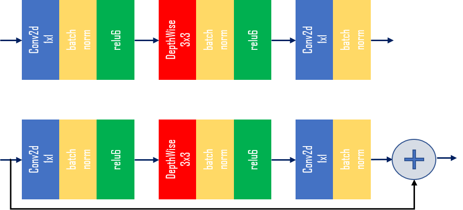

<!--
Author: Mark Harvey, Xilinx Inc
-->

# TensorFlow2 implementation of MobileNetV2</h1>

A TensorFlow2 version of MobileNetv2 with complete source code. The MobileNetv2 model is trained from scratch using the Kaggle dogs-vs-cats dataset.

### Current status

+ Tools used: TensorFlow 2.6.0
+ Dataset: [Kaggle dogs-vs-cats](https://www.kaggle.com/c/dogs-vs-cats/data)
+ Network: MobileNetv2

## Introduction

We will run the following steps:

  + Download and preparation of the Kaggle dogs-vs-cats dataset. Conversion of images to TFRecords.
  + Training and evaluation of the MobileNetV CNN using TensorFlow's built-in version of Keras.


## The Kaggle Dogs-vs-Cats Dataset

The [Kaggle dog-vs-cats dataset](https://www.kaggle.com/c/dogs-vs-cats/data) consists of 25000 images of varying dimensions, divided into the two classes of *cat* and *dog*. Each image is intrinsically labelled or classified by its filename, for example the image with filename *cat.12.jpg* is obviously of class *cat*.

There is also a set of labelled images which were part of the original Kaggle dogs-vs-cats challenge, but we will ignore this set and only use the 25000 images that are contained in the train.zip archive.

The 25000 images are all resized to 224 x 224 pixels and then divided into either the train or test datasets.

## MobileNetV2 architecture

MobileNetV2 was defined by Google as an extension and improvement on their earlier MobileNet architecture (now often referred to as MobileNetV1). It introduced the concepts of 'inverted residual' and 'linear bottleneck' blocks.

The complete architecture is composed of blocks like this:

<p align="center">
  
</p>

## Before You Begin

The host machine has several requirements that need to be met before we begin. You will need:

  + An x86 host machine with a supported OS and either the CPU or GPU versions of the Vitis-AI docker installed - see [System Requirements](https://github.com/Xilinx/Vitis-AI/blob/master/docs/learn/system_requirements.md).

  + The host machine will require Docker to be installed and the Vitis-AI CPU or GPU docker image to be built - see [Getting Started](https://github.com/Xilinx/Vitis-AI#getting-started).

  + A GPU card suitable for ML training - a GPU with at least 8GB of memory is recommended.

For more details, refer to the latest version of the *Vitis AI User Guide* ([UG1414](https://www.xilinx.com/html_docs/vitis_ai/1_4/zmw1606771874842.html)).

This tutorial assumes the user is familiar with Python3, TensorFlow and has some knowledge of machine learning principles.

## Setting up the workspace and dataset

1. Copy the repository by doing either of the following:

    + Download the repository as a ZIP file to the host machine, and then unzip the archive.
    + From a terminal, use the `git clone` command.

2. Download the Kaggle dogs-vs-cats dataset.

    + Go to the [Kaggle website](https://www.kaggle.com/c/dogs-vs-cats/data) and register a new account if necessary.
    + Download the [dataset](https://www.kaggle.com/c/dogs-vs-cats/data).
    + Move dogs-vs-cats.zip into the `scripts` folder in the design repository, which is the same folder that contains the python (`.py`) and shell (`.sh`) scripts.

    The Kaggle dog-vs-cats dataset consists of 25,000 images of varying dimensions, divided into two classes: cat and dog. Each image is intrinsically labelled or classified by its filename (for example, `cat.12.jpg`).

    There is a set of unlabelled images which were part of the original Kaggle dogs-vs-cats challenge, but we will not use it in this tutorial. Only the 25000 images that are contained in the `train.zip` archive will be used.

3. Open a linux terminal, `cd` to the repository folder, and then `cd` to the `scripts` folder.
   
4. Start the TensorFlow docker:

     ```shell
     # navigate to scripts folder
     cd tf2_mobilenet_v2/scripts

     # to start TF2 docker container
     source run_tf2_docker.sh
     ```

  Note that you will need an internet connection if you haven't already pulled the docker image from Docker Hub.

  The docker container will start and you should see something like this in the terminal:

    ```shell
        ________                               _______________                
    ___  __/__________________________________  ____/__  /________      __
    __  /  _  _ \_  __ \_  ___/  __ \_  ___/_  /_   __  /_  __ \_ | /| / /
    _  /   /  __/  / / /(__  )/ /_/ /  /   _  __/   _  / / /_/ /_ |/ |/ / 
    /_/    \___//_/ /_//____/ \____//_/    /_/      /_/  \____/____/|__/


    You are running this container as user with ID 15363 and group 1011,
    which should map to the ID and group for your user on the Docker host. Great!

    tf-docker /workspace > 
    ```

*The remainder of this README describes the steps to implement the design, however a shell script called run_all.sh is provided which will run the complete flow:*

```shell
(vitis-ai-tensorflow2) Vitis-AI /workspace > source run_all.sh
```


## Step 1 - Converting the dataset images to TFRecords

To run step 1:

```shell
tf-docker /workspace > python -u images_to_tfrec.py --build_dir build 2>&1 | tee build/logs/tfrec.log
```

To speed up training, the JPEG images of the dogs-vs-cats dataset will be converted into the TFRecord format. The `images_to_tfrec.py` script will do the following:

+ Unzip the dogs-vs-cats.zip archive into the folder.
+ Split the images into the train and test datasets, ensuring a balance between classes.
+ Convert each image and label into a TFRecord. The TFRecord files are written into .tfrecord files in the folder defined by the `--build_dir` argument.

Each TFRecord has five fields that are defined by the feature dictionary:

```python
# features dictionary
feature_dict = {
  'label' : _int64_feature(label),
  'height': _int64_feature(image_shape[0]),
  'width' : _int64_feature(image_shape[1]),
  'chans' : _int64_feature(image_shape[2]),
  'image' : _bytes_feature(image)
}
```

The label is obtained by looking at the first part of the image file name and assigning either '0' for dog or '1' for cat:

```python
class_name,_ = img.split('.',1)
if class_name == 'dog':
  label = 0
else:
  label = 1
```

Each JPEG image file is read into a TensorFlow string (tf.string) and its shape is obtained from the JPEG header - this avoids having to JPEG decode the image which means the script runs faster and also the TFRecord files are more compact:

```python
# read the JPEG source file into a tf.string
image = tf.io.read_file(filePath)

# get the shape of the image from the JPEG file header
image_shape = tf.io.extract_jpeg_shape(image, output_type=tf.dtypes.int32, name=None)
```

The number of image/label pairs in each .tfrecord file is defined by the `--img_shard` argument.

Note that this step only needs to be run once as long as the TFRecord files are not deleted.


The complete list of command line arguments of `images_to_tfrec.py` are as follows:

|Argument|Default|Description|
|:-------|:-----:|:----------|
|--build_dir|build|Build folder|
|--img_shard|2000|Shard size - number of images per TFRecord file|


## Step 2 - Training

To run step 1:

```shell
tf-docker /workspace >  python -u train.py --build_dir build 2>&1 | tee build/logs/train.log
```

During training, the TFRecord files are read into the tf.data pipeline by the `input_fn_trn` function defined in `dataset_utils.py`. This function finds all TFRecord files whose names match the pattern train_*.tfrecord and creates a tf.data.Dataset object. The function also includes all the image pre-processing (resizing and random cropping, augmentation and normalization):


```python
def input_fn_trn(tfrec_dir,batchsize,height,width):
  '''
  Dataset creation and augmentation for training
  '''
  tfrecord_files = tf.data.Dataset.list_files('{}/train_*.tfrecord'.format(tfrec_dir), shuffle=True)
  dataset = tf.data.TFRecordDataset(tfrecord_files)
  dataset = dataset.map(parser, num_parallel_calls=tf.data.experimental.AUTOTUNE)
  dataset = dataset.map(lambda x,y: resize_random_crop(x,y,h=height,w=width), num_parallel_calls=tf.data.experimental.AUTOTUNE)
  dataset = dataset.batch(batchsize, drop_remainder=False)
  dataset = dataset.map(augment, num_parallel_calls=tf.data.experimental.AUTOTUNE)
  dataset = dataset.map(normalize, num_parallel_calls=tf.data.experimental.AUTOTUNE)
  dataset = dataset.prefetch(buffer_size=tf.data.experimental.AUTOTUNE)
  dataset = dataset.repeat()
  return dataset
```


The test/validation phase uses the `input_fn_test` function which will make a dataset from all TFRecord files which match the glob pattern test_*.tfrecord. Note how there is no augmentation, only resizing and normalization and the dataset does not repeat:


```python
def input_fn_test(tfrec_dir,batchsize,height,width):
  '''
  Dataset creation and augmentation for test
  '''
  tfrecord_files = tf.data.Dataset.list_files('{}/test_*.tfrecord'.format(tfrec_dir), shuffle=False)
  dataset = tf.data.TFRecordDataset(tfrecord_files)
  dataset = dataset.map(parser, num_parallel_calls=tf.data.experimental.AUTOTUNE)
  dataset = dataset.map(lambda x,y: resize(x,y,h=height,w=width), num_parallel_calls=tf.data.experimental.AUTOTUNE)
  dataset = dataset.batch(batchsize, drop_remainder=False)
  dataset = dataset.map(normalize, num_parallel_calls=tf.data.experimental.AUTOTUNE)
  dataset = dataset.prefetch(buffer_size=tf.data.experimental.AUTOTUNE)
  return dataset
```

During training, the learning rate is modified by the `lr_scheduler_call` callback which uses the `step_decay` function to reduce the learning rate by 10 after 15 epochs, by 100 after 40 epochs:

```python
def step_decay(epoch):
    '''
    Learning rate scheduler used by callback
    Reduces learning rate depending on number of epochs
    '''
    lr = learnrate
    if epoch > 40:
        lr /= 100
    elif epoch > 15:
        lr /= 10
    return lr
```


The complete list of command line arguments of `train.py` are as follows:

|Argument|Default|Description|
|:-------|:-----:|:----------|
|--build_dir|build|Build folder|
|--input_height|224|Input images are resized to input_height x input_width|
|--input_width|224|Input images are resized to input_height x input_width|
|--input_chan|3|Number of channels in input image - leave at default|
|--batchsize|50|Batchsize used in training and validation - adjust for memory capacity of your GPU(s)|
|--epochs|50|Number of training epochs|
|--learnrate|0.001|Initial learning rate for optimizer|


## References

1. [MobileNetV2: Inverted Residuals and Linear Bottlenecks](https://arxiv.org/pdf/1801.04381v4.pdf), Sandler et al.
2. https://github.com/keras-team/keras-applications/blob/master/keras_applications/mobilenet_v2.py

</hr>
